# WelcomeHome

## 프로젝트 개요
맵 api 기반의 부동산 실거래가 조회 기능을 제공하는 Spring Boot & Vuejs 기반의 자바 웹 어플리케이션 서비스입니다.

## 프로젝트 기간 & 팀원
* 기간 : 2022. 05. 19 ~ 2022.05.26

* 팀원 : 김동욱, 박윤하
## Dev Stack
* Front-end

* Back-end

## 개발 환경

## UseCase Diagram
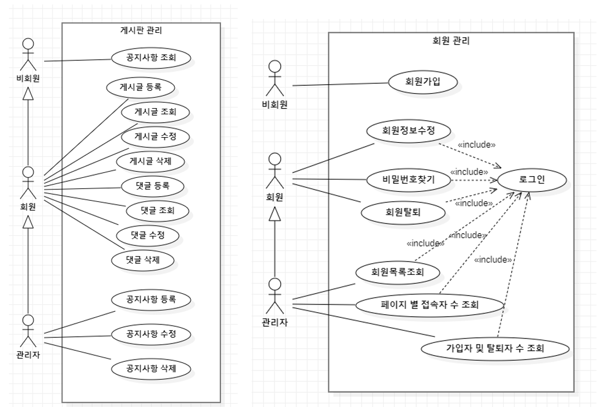
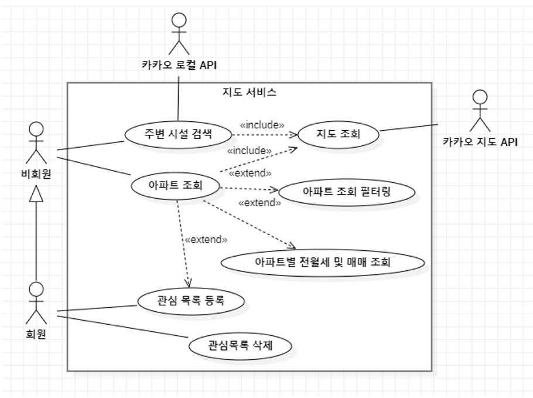

## 기능
<h3>main 화면</h3>
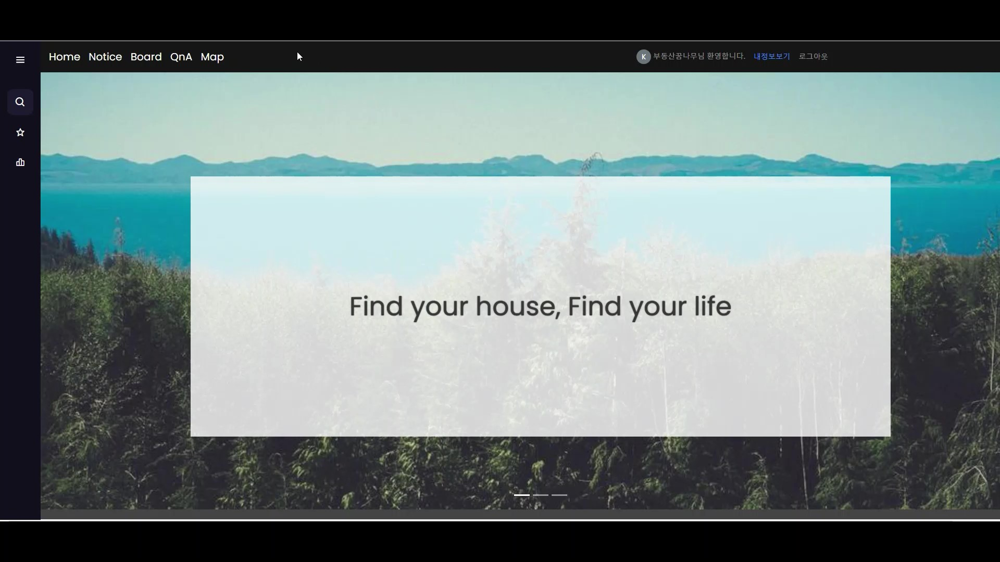
<h3>사용자 화면(회원 가입 및 로그인, 탈퇴 기능)</h3>
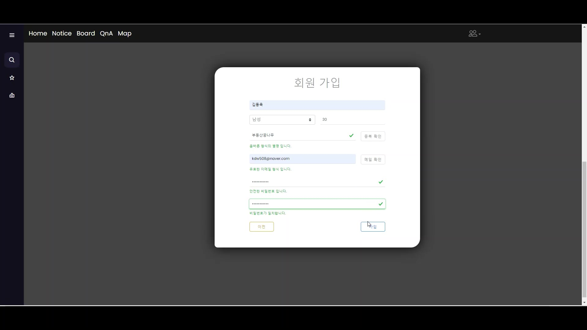
<h3>게시판 화면(글 작성 및 수정, 삭제 기능)</h3>
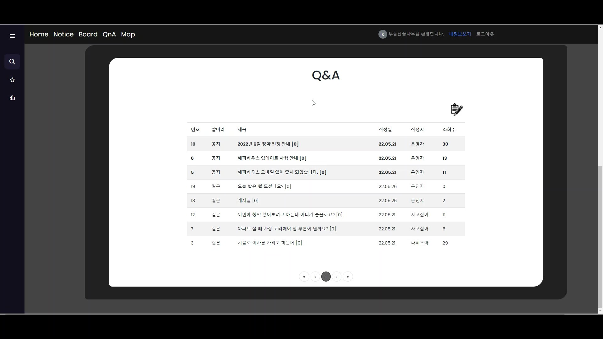
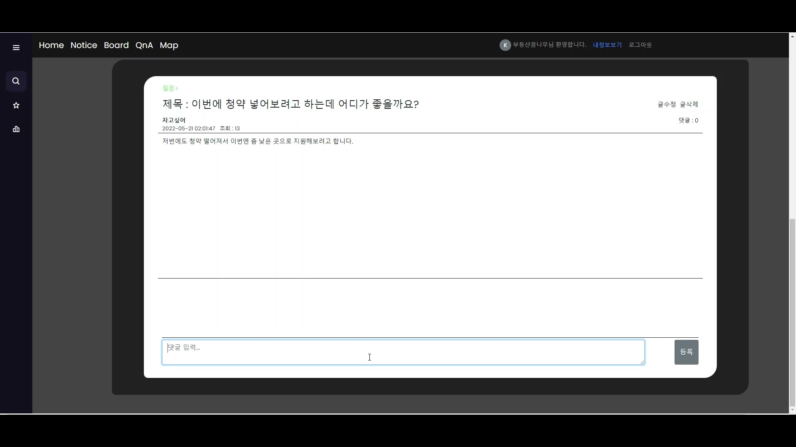
<h3>지도로 원하는 매물 찾기 기능 - KaKaoMap API 기반으로 원하는 조건에 맞춰서 아파트 마커 표시 및 클러스터 기능 제공</h3>
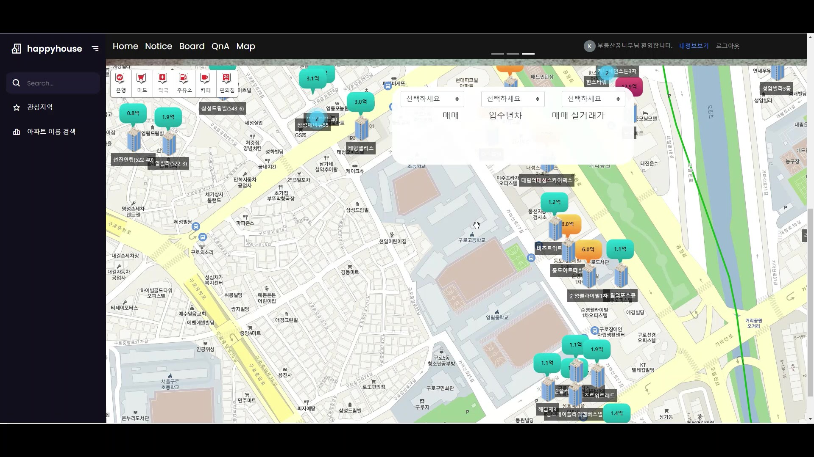
<h3>매물 상세조회 기능 - 마커 및 매물 카드 클릭 시 매물에 대한 상세 정보와 거래 이력을 표와 chart로 제공 및 관심 매물 등록 기능</h3>
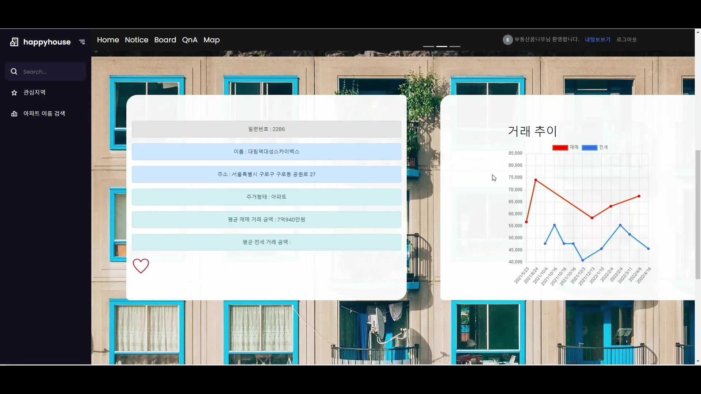
<h3>관심 매물,  최근 조회 매물 기능 - 매물에 대한 최근 거래 내역을 card로 제공</h3>
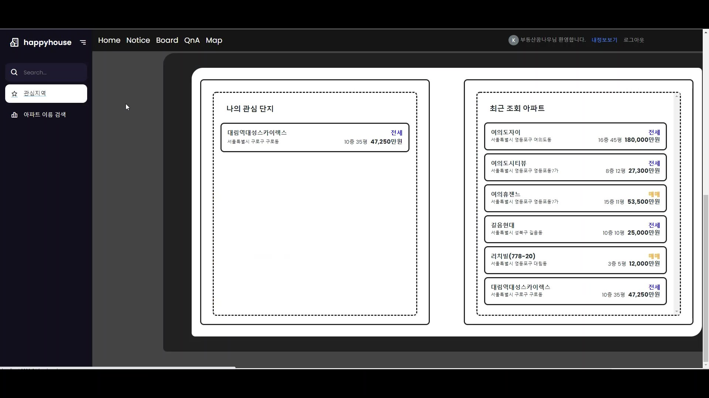
<h3>관리자 페이지, 회원 관리 기능 - 현재 사이트 유지, 보수를 위한 회원 통계 정보를 chart와 표로 제공</h3>
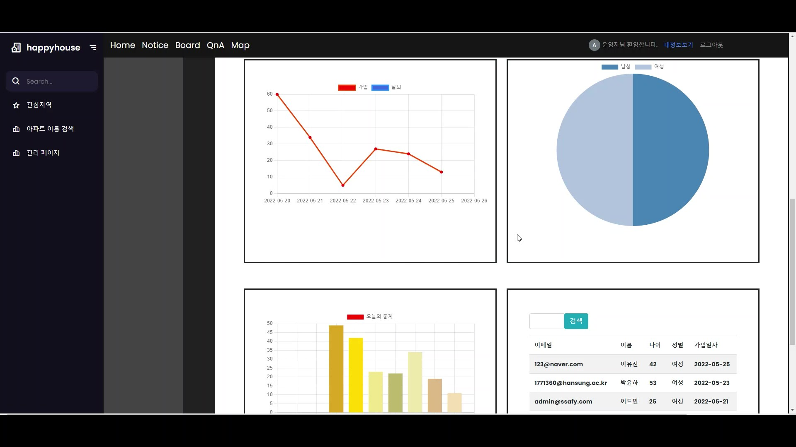

## Class Diagram
<h3>DTO</h3>
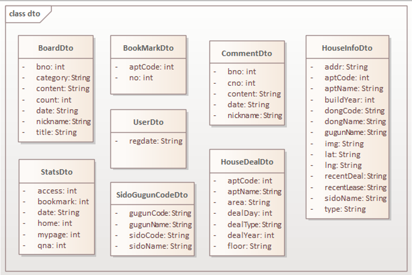
<h3>controller</h3>
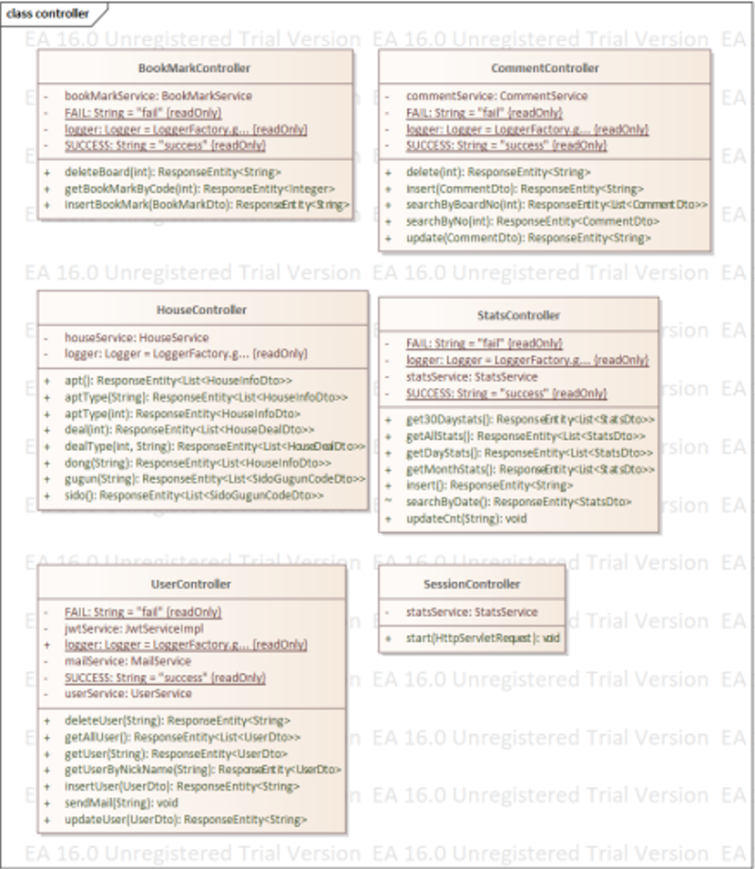
<h3>mapper</h3>
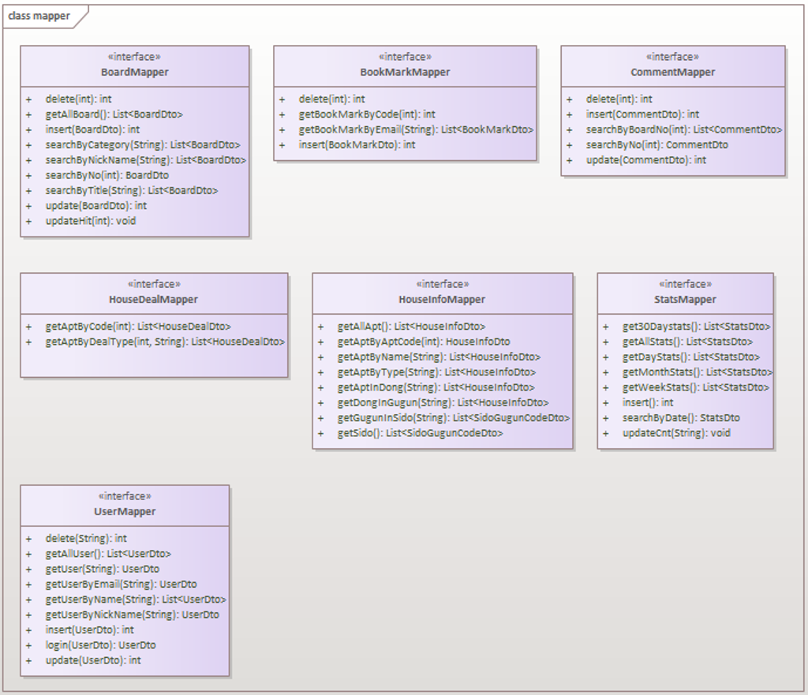
